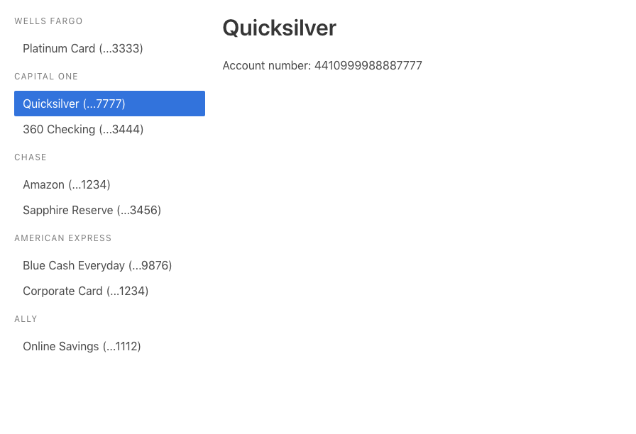

# Minty

Another application to track your expenses across your bank accounts.

## Requirements

- Ruby 2.6
- Node 11.x
- PostgreSQL 11.1

## Setup (backend)

```sh
git clone https://github.com/mickaelpham/minty
cd minty
bin/setup
```

Then start the Rails server:

    bin/rails server

## Setup (frontend)

```sh
# Assuming you are in the minty/ folder
cd frontend
yarn install
yarn start
```

## Screenshots


